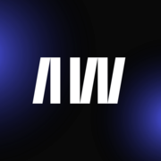

[![Youtube][youtube-shield]][youtube-url]
[![Facebook][facebook-shield]][facebook-url]
[![Facebook Page][facebook-shield]][facebook-group-url]
[![Instagram][instagram-shield]][instagram-url]
[![LinkedIn][linkedin-shield]][linkedin-url]
[![VS Code Theme][vscode-shield]][vscode-theme-url]

<!-- PROJECT LOGO -->
<br />
<p align="center">
    
    <h3 align="center">
        <a href="https://artistsweb.vercel.app" target="_blank" >
            Artistsweb Frontend
        </a>
    </h3>
</p>

## Description

This project is a frontend application for Artistsweb, designed to showcase artists and their works. It provides a user-friendly interface and integrates with the backend API for dynamic content.

### [Artistsweb Live](https://artistsweb.vercel.app/)

## API Repository

- API Repository: [Artistsweb API](https://github.com/noyonalways/artistsweb-api)

## Local Setup and Installation

1. Clone the repository:
   ```bash
   git clone https://github.com/noyonalways/artistsweb-frontend.git
   ```
2. Navigate to the project directory:
   ```bash
   cd artistsweb-frontend
   ```
3. Install the dependencies using npm or yarn:

   ```bash
   # Using npm
   npm install

   # OR using yarn
   yarn install
   ```

4. Set up your environment variables (following the `example.env` file):
   - Create a `.env` file in the root directory and add your API base URL:
     ```
     NEXT_PUBLIC_API_BASE_URL=your_api_base_url
     NODE_ENV=development
     ```
5. Start the development server:

   ```bash
   # Using npm
   npm run dev

   # OR using yarn
   yarn dev
   ```

## Contact

- Email: [noyonrahman2003@gmail.com](mailto:noyonrahman2003@gmail.com)
- LinkedIn: [Noyon Rahman](https://linkedin.com/in/noyonalways)

<!-- MARKDOWN LINKS & IMAGES -->

[youtube-shield]: https://img.shields.io/badge/-Youtube-black.svg?style=round-square&logo=youtube&color=555&logoColor=white
[youtube-url]: https://youtube.com/@deskofnoyon
[facebook-shield]: https://img.shields.io/badge/-Facebook-black.svg?style=round-square&logo=facebook&color=555&logoColor=white
[facebook-url]: https://facebook.com/noyonalways
[facebook-group-url]: https://facebook.com/webbronoyon
[instagram-shield]: https://img.shields.io/badge/-Instagram-black.svg?style=round-square&logo=instagram&color=555&logoColor=white
[instagram-url]: https://instagram.com/noyonalways
[linkedin-shield]: https://img.shields.io/badge/-LinkedIn-black.svg?style=round-square&logo=linkedin&colorB=555
[linkedin-url]: https://linkedin.com/in/noyonalways
[vscode-shield]: https://img.shields.io/badge/-VS%20Code%20Theme-black.svg?style=round-square&logo=visualstudiocode&colorB=555
[vscode-theme-url]: https://marketplace.visualstudio.com/items?itemName=noyonalways.codevibe-themes
